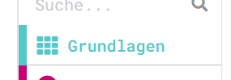
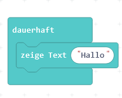

# Kapitel 2: EVA-Modell am Einplatinenrechner

Dieses Kapitel überträgt das klassische EVA-Modell (Eingabe, Verarbeitung, Ausgabe) auf den Calliope mini. Dazu müssen wir zuerst ein Programm schreiben, das der Calliope ausführen kann.

## Die Programmierumgebung

1. Starte die Calliope Programmierumgebung: [MakeCode](https://makecode.calliope.cc/#)
2. Klicke auf neues Projekt. Nenne dein Projekt "Hallo Welt"
3. Ziehe den "zeige Text" Block aus den "Grundlagen" in den Start Block

## Den Calliope mit dem Computer verbinden

Wir brauchen natürlich einen Calliope, der uns den Text anzeigt.
1. Stehe auf, hole dir einen der Calliope und ein USB-Kabel.
2. Schließe danach deinen Calliope mini über den USB-Anschluss am Rechner an.
3. Übertrage nun dein erstes Programm auf den Calliope mini! Klicke dazu rechts unten auf den Pfeil.

Die kleine gelbe LED auf der Vorderseite blinkt während der Übertragung und dann erscheint auf der Anzeige einmal die Begrüßung.

## Weiter zu den Aufgaben

Wenn alles geklappt hat und dir der Text angezeigt wurde, dann öffne den Link **deiner Gruppe!**

1. [Gruppe: Temperatur](https://makecode.calliope.cc/#tutorial:77807-52317-59667-10969)
2. [Gruppe: Lichtmessung](https://makecode.calliope.cc/#tutorial:30361-07079-84761-12736)
3. [Gruppe: Knöpfe und LED-Matrix](https://makecode.calliope.cc/#tutorial:40150-09307-82957-07082)
4. [Gruppe: Lautstärke](https://makecode.calliope.cc/#tutorial:23503-29971-10087-87636)
5. [Gruppe: Positionen](https://makecode.calliope.cc/#tutorial:67049-34458-35380-53540)